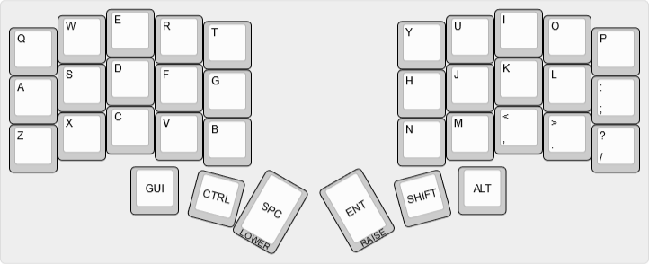
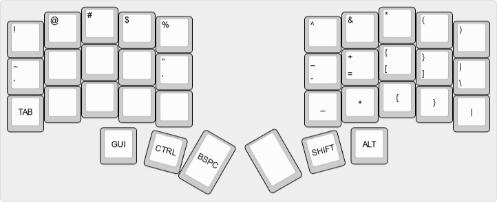

# Chocofi Config/Layout

Images produced using: [keyboard-layout-editor.com](http://www.keyboard-layout-editor.com/)

## Default Layer



## Lower Layer


## Upper Layer



Making a small documentation change


## Building Locally

**recommended** as nice as the github actions are, its like a 6 minute round trip to change a single key mapping

Follow toolchain setups

- https://zmk.dev/docs/development/setup
- https://docs.zephyrproject.org/3.2.0/develop/getting_started/index.html

### First Build

```
west build -d build/left -b nice_nano_v2 -- -DSHIELD=corne_left nice_view_adapter nice_view -DZMK_CONFIG=<path to repo folder>/config
west build -d build/right -b nice_nano_v2 -- -DSHIELD=corne_left nice_view_adapter nice_view -DZMK_CONFIG=<path to repo folder>/config
```

### Every time after

after initial build, all intermediate build artifacts and command line args are cached and you can just do

```
west build -d build/left
west build -d build/right
```
